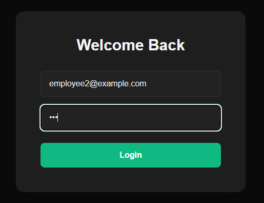
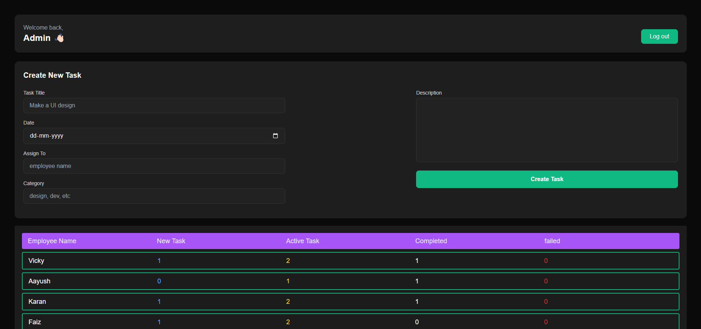
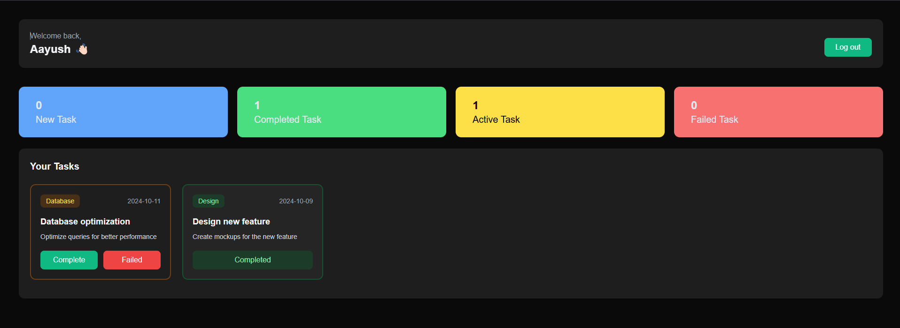

EMS (Employee Management System)

📚 Project Overview:
EMS is a web-based Employee Management System designed to simplify the management of employee data. Built using React, this project leverages local storage to ensure data persistence and provides a smooth user experience.

✨ Features:
Add Employees: Add new employee details including name, position, and more.
Edit Employee Details: Update existing employee records with ease.
Delete Employees: Remove employees when necessary.
Data Persistence: Employee data is stored locally in the browser, ensuring data is retained even after page reloads.
Responsive Design: Fully responsive UI for desktop and mobile devices.
🛠️ Tech Stack
Frontend: React
Storage: Local Storage
📸 Screenshots
<<<<<<< HEAD
  
  
  
=======

  
  
  
>>>>>>> a5f785418d27b740a89ee6361b07f78341b87e44

🚀 How to Run the Project Locally
Clone the repository:

Copy code - git clone https://github.com/your-username/ems-project.git 

Navigate to the project folder:
Copy code - cd ems-project

Install dependencies:
Copy code - npm install  

Start the development server:
Copy code - npm start

Open your browser and navigate to:

Copy code - http://localhost:3000  

💡 Lessons Learned
React State Management: Enhanced understanding of managing state using hooks.
Local Storage: Learned how to implement a lightweight data storage solution for small-scale projects.
UI/UX Design: Focused on creating a simple and intuitive user interface.

🌟 Future Enhancements
Integration with a backend API (Node.js/Express + MongoDB).
User authentication for secure data access.
Advanced features like search, filters, and sorting.

📫 Feedback & Suggestions
Feel free to fork this repository, raise issues, or suggest improvements via pull requests. I’d love to hear your feedback!

🔗 Connect with Me
LinkedIn: https://www.linkedin.com/in/nitish-kumar-38676b24b/
Twitter: @Nitish_65

📜 License
This project is licensed under the MIT License.
